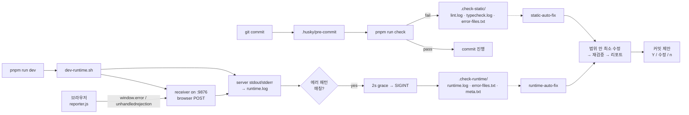

<div align="center">

# vibe-check-mate

**바이브 코딩의 가장 짜증나는 루프를 스킬 한 줄로 끝낸다.**

바이브 코딩의 **하네스 엔지니어링** — 품질 게이트(lint · 타입체크 · 런타임 에러)를 정형 로그로 자동 캡처하고, **스킬 한 줄이면 범위 안에서만 최소 수정 → 재검증 → 커밋 제안까지 원샷**으로 처리하는 Claude Code 플러그인.

[Install](#install) · [Why](#why) · [How it works](#how-it-works) · [Workflow](#workflow) · [Changelog](#changelog)


</div>

---

## Why

> "수정은 최소한으로만 해주세요." — 매일 쓰는 프롬프트
> "다 고쳤다면서요? dev 서버 켜니까 `TypeError: Cannot read properties of null`..." — 매일 하는 복붙
> "아니 왜 그 파일까지 고쳐요. 되돌려주세요." — 매일 하는 되돌리기

바이브 코딩은 **속도**를 주지만 **통제**를 잃습니다. 범위 밖 수정, 로그 복붙 루프, "다 됐습니다" 착시, AI 의 반복 시도로 인한 토큰 낭비, 커밋 메시지 즉흥. `vibe-check-mate` 는 이 다섯 가지를 **하네스 엔지니어링으로 한 번에 보강** — pre-commit 훅 · runtime 캡처 · 정형 로그 포맷 · 범위 강제 · 커밋 게이트를 단일 번들로 묶어 자동화합니다. **개발 흐름은 그대로.**

---

## Features

| | |
|---|---|
| 🎨 **Biome 린터·포맷터 자동 세팅** | `package.json` · `tsconfig.json` · 디렉터리 구조를 분석해 React / Strict 여부 판정 → `base` / `react` / `strict` 중 **최적 preset 자동 적용** · `@biomejs/biome` 설치와 `biome.json` 구성까지 원샷 |
| 🪝 **Husky pre-commit 훅** | 커밋 시도 → `pnpm run check` 자동 실행, 실패 시 `.check-static/` 정형 로그 3파일 |
| 🤖 **서버 + 클라이언트 런타임 에러 통합 캡처** | 터미널 stdout/stderr 는 `tail` 로 캡처, 브라우저 `window.error` / `unhandledrejection` 은 reporter → receiver 경로로 `[CLIENT_ERROR]` 태그 붙여 동일 `runtime.log` 로 수렴. Next.js client component · React hook · DOM event · 서버 SSR / API · Express / Nest 전부 한 로그 |
| ⚡ **dev server auto-kill** | 런타임 에러 패턴 (서버 + 클라이언트) 감지 → 2s grace → SIGINT → `.check-runtime/` finalize |
| 🎯 **범위 강제** | `error-files.txt` ∩ 실제 수정 ∩ tracked, 3조건 교집합만 수정 · refactor / 네이밍 변경 / 신규 파일 금지 |
| 📝 **정형 리포트** | 모든 종료 지점에 케이스별 리포트 강제 출력 (path:line + 근거) · 침묵 exit 금지 |
| 💬 **커밋 제안** | Conventional Commits 자동 생성 → Y/수정/n 게이트 · Co-Authored-By 금지 · push 기본 금지 |
| 🗂 **분할 + push** | 기존 staged 작업 있어도 중단 없이 2커밋 분할 후 auto-push (단일 Y 게이트) |
| 🛑 **반복 수정 차단** | 최대 1회 시도 · 동일 에러 시그니처 반복 시 즉시 종료 (토큰 낭비 방지) |

---

## How it works



**`.check-*/` 는 "지금 실패" 스냅샷만 의미합니다.** 통과하거나 수정이 반영되면 자동 삭제. 스킬은 항상 최신 상태만 신뢰.

---

## Install

Claude Code 안에서:

```
/plugin marketplace add letYuchan/vibe-check-mate
/plugin install vibe-check-mate@vibe-check-mate-marketplace
```

로컬 개발 모드:

```
/plugin marketplace add /path/to/vibe-check-mate
/plugin install vibe-check-mate@vibe-check-mate-marketplace
```

프로젝트 루트에서 한 방 부트스트랩:

```
/vibe-check-mate:setup
```

실행 후 자동 구성:

| 구분 | 경로 |
|------|------|
| 정적 검사 래퍼 | `scripts/run-static-check-with-logs.sh` |
| dev 런타임 캡처 + auto-kill | `scripts/dev-runtime.sh` |
| 브라우저 에러 receiver | `scripts/client-error-receiver.py` (Python 3 필요) |
| 브라우저 에러 reporter | `scripts/client-error-reporter.js` + `public/client-error-reporter.js` |
| Biome preset | `biome-config/biome.{base,react,strict}.json` |
| 루트 biome 설정 | `biome.json` (감지된 preset 으로 `extends`) |
| pre-commit 훅 | `.husky/pre-commit` |
| package.json scripts | `lint` · `lint:fix` · `typecheck` · `check` · `dev` · `dev:raw` |
| devDependencies | `@biomejs/biome` · `husky` |

> 권장 `.gitignore`: `.check-static/`, `.check-runtime/`

### 브라우저 reporter 주입 (v0.4.1+ 자동)

`/vibe-check-mate:setup` 이 framework 를 감지해서 entry 파일에 `<script>` 를 **자동 주입**합니다:

| 감지 조건 | 주입 대상 |
|----------|-----------|
| `app/layout.tsx` 존재 | Next.js app router — `<body>` 안 |
| `pages/_document.tsx` 존재 | Next.js pages router — `<Head>` 안 |
| `app/root.tsx` + `@remix-run/*` deps | Remix — `<head>` 안 |
| `index.html` 루트 존재 | Vite / 순수 SPA — `<head>` 안 |

주입 전 중복·모호성 검사 통과해야만 실행. 실패·skip 시 framework 별 수동 스니펫을 리포트에 포함. reporter 는 `localhost` / `127.0.0.1` 에서만 동작 (프로덕션 no-op).

---

## Workflow

### 커밋이 lint / typecheck 로 차단될 때

```
static-auto-fix 돌려줘
```

→ 범위 안 최소 수정 → 재검증 → 정형 리포트 → 커밋 제안 `(Y / 수정 / n)`

### dev 서버에서 런타임 에러가 날 때

dev server 가 auto-kill 되고 `.check-runtime/` 가 자동으로 finalize 됩니다.

```
runtime-auto-fix 돌려줘
```

→ 범위 안 최소 수정 → `.check-runtime/` 자동 삭제 → 정형 리포트 → 커밋 제안

### 리포트 예시

```
✅ static check 통과

수정 대상: src/user.ts, src/post.ts
해결된 에러:
  - src/user.ts:12 — TS2322 : string → number 타입 맞춤
  - src/post.ts:5  — biome noVar : var → const
검증: pnpm run check ✓
정리: .check-static/ 삭제됨
커밋 제안: fix: resolve lint and type errors in src/ — (Y / 수정 / n)
```

### 스테이징 충돌 시 자동 분할 + push

이미 staged 된 작업이 있으면 block 하지 않고:

```
🗂 커밋 분할 + push 제안

[1/2 pre-staged] docs: update README
[2/2 fix]        fix: resolve type errors in src/user.ts

승인 시 위 순서로 커밋 후 git push 실행. (Y / 수정1 / 수정2 / n)
```

---

## Design principles

- **Deterministic 검증, constrained 수정** — 셸 스크립트는 결과를 재현 가능하게 기록, AI 는 기록된 범위 안에서만 수정
- `.check-*/` 는 누적 로그가 아닌 **"최신 실패 상태" 플래그** (통과·수정되면 자동 제거)
- `pre-commit` 은 **차단 + 로깅**만 담당, AI 수정은 별도 단계
- 런타임 문제와 정적 문제를 한 스킬에 **섞지 않음**
- 모든 종료 지점에서 **정형 리포트 강제 출력** (침묵 exit 금지)
- `git push` 기본 금지, 분할 경로에서만 명시 승인 후 예외 허용

---

## Prerequisites

사용자가 사전에 준비해야 할 것 — 플러그인은 이것들을 **설치하지 않음**.

- **Node.js 18+**
- **pnpm** — 현재 래퍼 스크립트가 pnpm 전제 (npm / yarn / bun 미지원)
- **Python 3** — 브라우저 에러 receiver 용 (stdlib 만 사용, pip 설치 불필요)
- **git** — 저장소로 초기화된 프로젝트
- **dev server / bundler** — Vite · Next.js · Remix · Astro · Express · NestJS · 순수 Node 스크립트 등 **사용자가 직접 선택·설치**. 플러그인은 bundler/framework 를 선택하거나 설치하지 않고, 이미 존재하는 dev 환경 위에 harness 레이어만 덮음.
- **TypeScript** (있으면 typecheck 동작, 없어도 lint + runtime 캡처는 가능)
- **Claude Code** — 플러그인 호스트

## What the plugin installs

`/vibe-check-mate:setup` 실행 시 자동 추가:

| 자산 | 목적 |
|------|------|
| `@biomejs/biome` (devDep) | Rust 기반 린터/포맷터 — ESLint + Prettier 통합 대체. 프로젝트 유형 감지해 `base` / `react` / `strict` 중 **최적 preset 자동 선택** |
| `husky` (devDep) | git hook 관리 |
| `biome-config/biome.{base,react,strict}.json` | 3 종 preset 템플릿 |
| `biome.json` | 감지된 preset 으로 `extends` 구성된 루트 설정 |
| `.husky/pre-commit` | `pnpm run check` 를 실행하는 hook |
| `scripts/run-static-check-with-logs.sh` | lint + typecheck 래퍼 (`.check-static/` 생성) |
| `scripts/dev-runtime.sh` | dev server 래퍼 (auto-kill + receiver 기동) |
| `scripts/client-error-receiver.py` | Python 3 HTTP 서버, 브라우저 에러 수신 |
| `scripts/client-error-reporter.js` | 브라우저용 에러 리포터 (localhost 한정, 프로덕션 no-op) |
| `public/client-error-reporter.js` 또는 루트 | 웹에서 서빙되는 reporter 위치 (v0.4.5 의 publicDir 감지 결과에 따라 배치) |
| `package.json` scripts | `lint` · `lint:fix` · `typecheck` · `check` · `dev` · `dev:raw` · `prepare` 추가/재정렬 |
| `index.html` 등 entry 파일 | `<script src="/client-error-reporter.js">` 자동 주입 (v0.4.1 의 framework 감지 결과에 따라) |

---

## Changelog

### v0.4.5
- **커스텀 `publicDir` 존중** — `vite.config.{ts,js,mjs,cjs}` 파싱해서 `publicDir: "<custom>"` 설정되어 있으면 그 경로에 reporter 복사 (없으면 생성), `publicDir: false` 면 skip + 수동 스니펫. 사용자의 vite 정적 자산 경로 설정을 덮어쓰지 않음
- 우선순위: vite.config publicDir > framework deps (vite/next/remix) 관례값 `public/` > 루트 (plain HTML)
- 리포트에 복사 경로 + 이유(`reason: ...`) 명시해서 사용자가 추적 가능

### v0.4.4
- **`public/` 자동 생성 분기 보강** — 이전엔 `vite.config.*` 파일 존재만 봐서, vite deps 는 있지만 config 파일을 만들지 않은 프로젝트가 "plain SPA" 로 잘못 판정되어 reporter 가 루트에 복사되고 vite 가 404 로 서빙 실패. 이제 `package.json` 의 `vite` / `next` / `@remix-run/*` deps 도 검사해서 framework 프로젝트면 `public/` 자동 생성 후 복사

### v0.4.3
- **`client-error-reporter.js` 를 현대 JS 로 재작성** — `var` → `const`, `function () {}` → `arrow function`, `x && x.y` → `x?.y`, empty catch 블록에 주석 추가. biome strict 룰을 **기본 통과**하도록 정비. 이전 버전에서 reporter 사본이 프로젝트에 배포되면 사용자의 biome 이 자기 preset 으로 lint 해서 실패하던 순환 제거
- **`biome lint --max-diagnostics=1000`** 로 skill 의 package.json scripts 갱신 — 이전엔 biome 기본값 20 에 걸려 대규모 프로젝트에서 일부 진단이 로그에서 잘리고 `error-files.txt` 에 누락됨. 이제 한도 1000 으로 충분

### v0.4.2
- **Idempotency 거짓 양성 수정** — 이전엔 `client-error-reporter` 단순 substring 매칭이라 `<code>` / 주석 / escape된 설명 텍스트에도 반응해 false-positive skip. 이제 literal `<script src="/client-error-reporter.js"` 또는 `<Script src="/client-error-reporter.js"` 같은 **실제 태그 opening** 만 감지
- **`public/` 자동 생성** — vite-or-spa 타겟에서 `vite.config.*` 없고 framework 도 없는 plain SPA 케이스는 `index.html` 과 **같은 디렉터리**에 reporter 복사 (정적 서버가 `/client-error-reporter.js` 로 서빙 가능하게). Next / Remix / Vite 프로젝트는 `public/` 자동 생성 후 복사

### v0.4.1
- **브라우저 reporter 자동 주입** — `/vibe-check-mate:setup` 이 framework 를 감지 (Next.js app/pages router · Remix · Vite · 순수 SPA) 하고 해당 entry 파일 (`app/layout.tsx`, `pages/_document.tsx`, `app/root.tsx`, `index.html`) 에 `<script src="/client-error-reporter.js">` 를 자동 삽입
- 주입 전 **pre-check** (`client-error-reporter` 중복 체크, 대상 태그 정확히 1회 매칭) 통과한 경우에만 Edit 실행 — 모호하면 주입 시도조차 안 함
- 주입 후 **검증** 실패 시 역치환으로 **롤백** 시도 → 실패하면 `git restore` 안내
- skip / 실패 시 사용자에게 framework 별 **수동 삽입 스니펫을 리포트에 포함** (원인 + 정확한 복붙 위치까지)

### v0.4.0
- **서버 + 클라이언트 런타임 에러 통합 캡처** — 브라우저 `window.error` / `unhandledrejection` 을 `client-error-reporter.js` 가 `localhost:9876` 의 Python receiver 로 POST, receiver 가 동일 `runtime.log` 에 `[CLIENT_ERROR]` / `[CLIENT_STACK]` 라인 append. Next.js client component · React hook · DOM event 에러도 이제 `.check-runtime/` 에 포함됨
- `dev-runtime.sh` 가 receiver 를 자동 기동 (`python3` + `scripts/client-error-receiver.py` 존재 시), ERROR_PATTERNS 에 `\[CLIENT_ERROR\]` 추가되어 auto-kill 이 클라이언트 에러에도 발동
- `VIBE_CLIENT_ERROR_PORT=9876` 환경 변수로 포트 커스터마이즈
- reporter 는 `localhost` / `127.0.0.1` / `[::1]` 에서만 동작하고 프로덕션 번들에서는 no-op
- `/vibe-check-mate:setup` 가 reporter 를 `scripts/` 와 `public/` 양쪽에 복사, framework 별 `<script>` 삽입 스니펫 리포트에 포함

### v0.3.3
- `dev-runtime.sh` 의 background watcher / tail 에 `disown` 적용 — dev server 가 정상 종료되거나 auto-kill 이 발동할 때 bash 가 남기던 `Terminated: 15` 알림 억제

### v0.3.2
- **Biome 2.x CLI 플래그 정정** — 스킬에 기록된 `biome check . --apply` 를 `biome lint --write .` 로 업데이트. Biome 2.x 에서 `--apply` 는 deprecated → 제거돼 매 setup 마다 Claude 가 불필요한 재교정 루프를 돌던 문제 해결
- `lint` / `lint:fix` 스크립트가 `biome lint` 서브커맨드로 정렬 (`check` 스크립트와 역할 분리 명확)

### v0.3.1
- `runtime-auto-fix` 수정 성공 시 `.check-runtime/` **자동 삭제** (static 쪽과 대칭)

### v0.3.0
- **dev server auto-kill** — `TypeError` · `ReferenceError` · `SyntaxError` · `Uncaught` · `Cannot find module` · `✘ [ERROR]` 감지 시 2초 grace 후 자동 SIGINT
- `VIBE_DEV_NO_AUTOKILL=1`, `VIBE_DEV_AUTOKILL_GRACE=<sec>` 환경 변수 지원
- 케이스 4 는 fallback 으로 유지 (클라이언트 전용 에러 · auto-kill 비활성화 대응)

### v0.2.0
- **스테이징 충돌 시 자동 분할 + push** 경로 (block 없음, 단일 Y 게이트)
- **모든 종료 지점 리포트 케이스 강제 매핑** (침묵 exit 금지)
- **bash chaining `;` 금지** (exit code 오판 방지)
- **반복 수정 루프 방지** — 최대 1회 시도, 동일 시그니처 반복 시 즉시 종료
- `biome.base.json` preset self-check 통과
- README pain-point 중심 재작성

### v0.1.1
- 셸 스크립트 `set -euo pipefail` 제거 — 각 체크가 실패해도 양쪽 로그 모두 기록
- Pre-flight 3중 검사 (git identity · rebase state · 스테이징)
- Auto-commit scope 엄격화 — `error-files.txt` ∩ 실제 수정 ∩ tracked
- HMR dev server Ctrl+C 안내 + SIGINT trap

### v0.1.0
- 초기 릴리스

---

## License

[MIT](./LICENSE) — Ship without breaking the flow.
