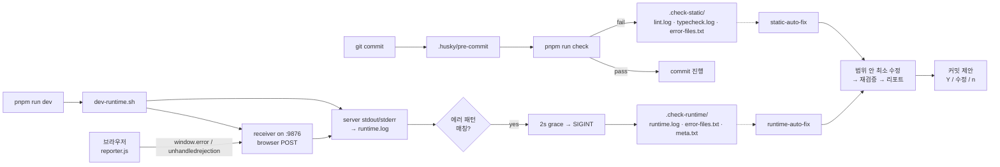

<div align="center">

# vibe-check-mate

**바이브 코딩의 가장 짜증나는 검증 루프를 스킬 한 줄로 끝낸다.**

바이브 코딩의 **하네스 엔지니어링** — 기존 프로젝트의 lint · typecheck · 런타임 에러를 정형 로그로 캡처하고, **스킬 한 줄이면 범위 안에서만 최소 수정 → 재검증 → 커밋 제안**까지 처리하는 Claude Code 플러그인.

[Install](#install) · [Why](#why) · [How-it-works](#how-it-works) · [Workflow](#workflow)


</div>

---

## Why

> "수정은 최소한으로만 해주세요." — 매일 쓰는 프롬프트
> "다 고쳤다면서요? dev 서버 켜니까 `TypeError: Cannot read properties of null`..." — 매일 하는 복붙
> "아니 왜 그 파일까지 고쳐요. 되돌려주세요." — 매일 하는 되돌리기

AI 코딩은 속도를 주지만 통제도 쉽게 잃습니다. 범위 밖 수정, 로그 복붙 루프, "다 됐습니다" 착시, 반복 수정으로 인한 토큰 낭비, 즉흥 커밋 메시지. `vibe-check-mate`는 pre-commit 훅 · runtime 캡처 · 정형 로그 포맷 · 범위 강제 · 커밋 게이트를 단일 하네스로 묶습니다.

---

## Features

| | |
|---|---|
| 🪝 **Husky pre-commit 훅** | 커밋 시도 → `pnpm run check` 자동 실행, 실패 시 `.check-static/` 정형 로그 3파일 |
| 📋 **정적 검사 로그화** | 프로젝트에 이미 있는 `lint` / `typecheck` 스크립트를 실행하고 최신 실패 상태만 저장 |
| 🤖 **서버 + 클라이언트 런타임 에러 통합 캡처** | 터미널 stdout/stderr와 브라우저 `window.error` / `unhandledrejection`을 동일 `runtime.log`로 수렴 |
| ⚡ **dev server auto-kill** | 런타임 에러 패턴 감지 → 2s grace → SIGINT → `.check-runtime/` finalize |
| 🎯 **범위 강제** | `error-files.txt` ∩ 실제 수정 ∩ tracked, 3조건 교집합만 수정 |
| 📝 **정형 리포트** | 모든 종료 지점에 케이스별 리포트 강제 출력 |
| 💬 **커밋 제안** | Conventional Commits 자동 생성 → Y/수정/n 게이트 |
| 🛑 **반복 수정 차단** | 최대 1회 시도 · 동일 에러 시그니처 반복 시 즉시 종료 |

---

## How It Works



**`.check-*/`는 "지금 실패" 스냅샷만 의미합니다.** 통과하거나 수정이 반영되면 자동 삭제합니다.

---

## Install

Claude Code 안에서:

```text
/plugin marketplace add letYuchan/vibe-check-mate
/plugin install vibe-check-mate@vibe-check-mate-marketplace
```

로컬 개발 모드:

```text
/plugin marketplace add /path/to/vibe-check-mate
/plugin install vibe-check-mate@vibe-check-mate-marketplace
```

프로젝트 루트에서:

```text
/vibe-check-mate:setup
```

실행 후 자동 구성:

| 구분 | 경로 |
|------|------|
| 정적 검사 래퍼 | `scripts/run-static-check-with-logs.sh` |
| dev 런타임 캡처 + auto-kill | `scripts/dev-runtime.sh` |
| 브라우저 에러 receiver | `scripts/client-error-receiver.py` |
| 브라우저 에러 reporter | `scripts/client-error-reporter.js` + 웹 루트 사본 |
| pre-commit 훅 | `.husky/pre-commit` |
| package.json scripts | `check` · `dev` · `dev:raw` |
| devDependencies | `husky` |

> 권장 `.gitignore`: `.check-static/`, `.check-runtime/`

### Prerequisites

이 플러그인은 lint/typecheck 도구를 선택하거나 설치하지 않습니다. 대상 프로젝트에 아래가 이미 있어야 합니다.

- **Node.js 18+**
- **pnpm**
- **git**
- **Python 3** — 브라우저 에러 receiver 용
- **package.json scripts** — `lint`, `typecheck`
- **dev server script** — 기존 `dev`
- **Claude Code** — 플러그인 호스트

---

## Workflow

### 커밋이 lint / typecheck로 차단될 때

```text
static-auto-fix 돌려줘
```

→ 범위 안 최소 수정 → 재검증 → 정형 리포트 → 커밋 제안 `(Y / 수정 / n)`

### dev 서버에서 런타임 에러가 날 때

dev server가 auto-kill 되고 `.check-runtime/`이 finalize 됩니다.

```text
runtime-auto-fix 돌려줘
```

→ 범위 안 최소 수정 → `.check-runtime/` 삭제 → 정형 리포트 → 커밋 제안

### 리포트 예시

```text
✅ static check 통과

수정 대상: src/user.ts, src/post.ts
해결된 에러:
  - src/user.ts:12 — TS2322 : string → number 타입 맞춤
  - src/post.ts:5  — lint noVar : var → const
검증: pnpm run check 통과
정리: .check-static/ 삭제됨
커밋 제안: fix: resolve lint and type errors in src — (Y / 수정 / n)
```

---

## Design Principles

- **Deterministic 검증, constrained 수정** — 셸 스크립트는 결과를 재현 가능하게 기록, AI는 기록된 범위 안에서만 수정
- `.check-*/`는 누적 로그가 아닌 **최신 실패 상태** 플래그
- `pre-commit`은 **차단 + 로깅**만 담당, AI 수정은 별도 스킬에서 수행
- 런타임 문제와 정적 문제를 한 스킬에 섞지 않음
- 모든 종료 지점에서 정형 리포트 출력
- `git push` 기본 금지, 분할 경로에서만 명시 승인 후 예외 허용

---

## License

[MIT](./LICENSE) — Ship without breaking the flow.
