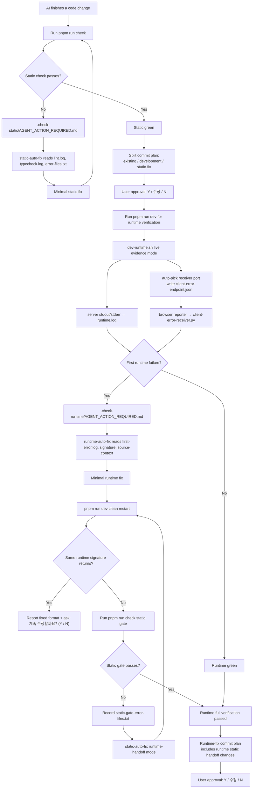

<div align="center">

# vibe-check-mate

**AI가 개발을 끝냈다고 말하기 전에, 정적 에러와 런타임 에러를 알아서 끝까지 물고 늘어지는 검증 하네스.**

`vibe-check-mate`는 AI 코딩 프로젝트에 **정적 검사 → 런타임 검증 → 재검증 → 커밋 제안** 흐름을 붙이는 Claude Code 플러그인입니다. 사용자가 매번 "이 로그 읽고 고쳐줘"라고 프롬프트하지 않아도, action file과 skill 규칙이 AI에게 다음 행동을 강제합니다.

[Install](#install) · [User Flow](#user-flow) · [Automation Graph](#automation-graph) · [What Changed in 0.6.0](#what-changed-in-060)


</div>

---

## Why

AI 코딩에서 가장 피곤한 순간은 "수정했습니다" 다음입니다.

- 커밋하려니 lint/typecheck가 터짐
- dev server를 켜니 브라우저나 API 런타임 에러가 터짐
- 에러 로그를 다시 복사해서 "이거 고쳐"라고 말해야 함
- 고쳤다는데 또 다른 static/runtime 에러가 생김
- 커밋은 개발 변경, fix 변경, 이전 변경이 뒤섞임

`vibe-check-mate`는 이 루프를 **프롬프트 루프가 아니라 상태 기반 자동화 루프**로 바꿉니다. 실패가 생기면 `.check-static/AGENT_ACTION_REQUIRED.md` 또는 `.check-runtime/AGENT_ACTION_REQUIRED.md`가 생성되고, AI는 해당 파일과 skill을 따라 정확한 양식으로 수정, 재검증, 커밋 계획까지 진행합니다.

---

## Features

| | |
|---|---|
| **Static action file** | `pnpm run check` 실패를 `.check-static/lint.log`, `typecheck.log`, `error-files.txt`, `AGENT_ACTION_REQUIRED.md`로 고정 |
| **Runtime first snapshot** | 첫 런타임 실패를 `.check-runtime/first-error.log`, `error-signature.txt`, `source-context.md`로 잠금 |
| **Live runtime evidence** | dev server를 기본적으로 죽이지 않고 `runtime.log`에 계속 기록 |
| **Browser + network capture** | `window.error`, `unhandledrejection`, `fetch`, `XMLHttpRequest` 4xx/5xx/failure/slow request를 수집 |
| **Receiver port auto-pick** | 기본 `9876`이 사용 중이면 다음 포트를 고르고 `client-error-endpoint.json`으로 reporter와 연결 |
| **Runtime → static handoff** | runtime fix 후 `pnpm run check`를 강제하고 실패하면 `static-auto-fix`로 넘긴 뒤 다시 runtime clean restart |
| **Candidate preservation** | clean restart 사이에도 `runtime-fix-files.txt`, `static-gate-error-files.txt`로 커밋 후보 파일 보존 |
| **Strict report templates** | 성공/실패/스킵/재시도 질문의 출력 양식을 고정 |
| **Split commit plan** | existing / development / static-fix / runtime-fix bucket을 나누고 `Y / 수정 / N` 승인 게이트 적용 |

---

## User Flow

사용자는 AGENTS.md에 한 번만 운영 규칙을 적어두면 됩니다.

```md
코드 작업 완료 후 반드시 `pnpm run check`를 실행한다.
실패하면 `.check-static/AGENT_ACTION_REQUIRED.md`를 먼저 읽는다. 이 파일의 지시에 따라 `static-auto-fix`를 실행한다.
정적 검사가 통과하면 development 변경과 static-fix 변경을 분할 커밋하고 사용자 `Y` 승인 후 push한다.
그 다음 `pnpm run dev`로 런타임을 검증한다.
`.check-runtime/AGENT_ACTION_REQUIRED.md`가 생성되면 먼저 읽는다. 이 파일의 지시에 따라 `runtime-auto-fix`를 실행한다.
runtime fix 후에는 `pnpm run dev` clean restart와 `pnpm run check` static gate를 모두 통과해야 한다.
runtime 검증 단계에서 생긴 static 수정은 runtime-fix bucket에 포함하고, 사용자 `Y` 승인 후 runtime-fix 커밋을 push한다.
```

그 다음부터는 사용자가 매번 에러 로그를 붙여넣을 필요가 없습니다.

```text
AI 개발 완료
→ pnpm run check
→ static 실패면 .check-static/AGENT_ACTION_REQUIRED.md 읽기
→ static-auto-fix
→ pnpm run check 재검증
→ development + static-fix 분할 커밋 제안
→ 사용자 Y 승인 후 push
→ pnpm run dev 런타임 검증
→ runtime 실패면 .check-runtime/AGENT_ACTION_REQUIRED.md 읽기
→ runtime-auto-fix
→ runtime fix
→ pnpm run dev clean restart
→ pnpm run check static gate
→ static 실패면 static-auto-fix runtime-handoff
→ 다시 pnpm run dev clean restart
→ full green
→ runtime-fix 커밋 제안
→ 사용자 Y 승인 후 push
```

---

## Automation Graph



---

## Install

Claude Code 안에서:

```text
/plugin marketplace add letYuchan/vibe-check-mate
/plugin install vibe-check-mate@vibe-check-mate-marketplace
```

로컬 개발 모드:

```text
/plugin marketplace add /path/to/vibe-check-mate
/plugin install vibe-check-mate@vibe-check-mate-marketplace
```

프로젝트 루트에서:

```text
/vibe-check-mate:setup
```

설치되는 구성:

| 구분 | 경로 |
|---|---|
| Static check wrapper | `scripts/run-static-check-with-logs.sh` |
| Runtime live evidence wrapper | `scripts/dev-runtime.sh` |
| Browser receiver | `scripts/client-error-receiver.py` |
| Browser reporter | `scripts/client-error-reporter.js` + web root copy |
| Browser endpoint config | `client-error-endpoint.json` in the reporter web root |
| Pre-commit hook | `.husky/pre-commit` |
| Static source of truth | `.check-static/` |
| Runtime source of truth | `.check-runtime/` |

---

## Prerequisites

`vibe-check-mate`는 lint/typecheck 도구를 설치하지 않습니다. Biome 설정은 [vibe-biome-wizard](https://github.com/letYuchan/vibe-biome-wizard)가 담당합니다.

- Node.js 18+
- pnpm
- git
- Python 3 for browser receiver
- `package.json` scripts: `lint`, `typecheck`, `dev`

---

## What Changed in 0.6.0

이번 버전의 핵심은 **사용자가 정적 에러/런타임 에러마다 프롬프트하지 않아도 AI가 상태 파일을 따라 자동으로 고치고 재검증하는 흐름**입니다.

- runtime fix 후 `pnpm run check` static gate 강제
- static gate 실패 시 `static-auto-fix`를 runtime-handoff mode로 실행
- static fix 후 다시 runtime clean restart로 복귀
- `runtime-fix-files.txt`, `static-gate-error-files.txt`로 clean restart 사이 커밋 후보 보존
- `error-files.txt`에 실제 존재하는 프로젝트 파일만 남기도록 보정
- browser network evidence에 status, URL, query string, request headers/body, message 기록
- browser receiver port 자동 선택과 `client-error-endpoint.json` 연결
- token/password/authorization/cookie류 민감값 redaction
- setup 검증을 최신 live evidence / static gate / handoff 기준으로 업데이트
- 모든 commit/push는 사용자 `Y` 승인 후에만 실행

---

## Commit Policy

검증이 통과하면 AI는 바로 커밋하지 않고 계획을 제안합니다.

```text
## 🧪 runtime verification commit plan

[1/N existing]    <message or 없음>
[N/N runtime-fix] <message>

검증: pnpm run dev 재시작 후 같은 signature 재발 없음 + pnpm run check 통과
승인 시 commit 후 git push 실행. (Y / 수정 / N)
```

정적 검사 단독 실패에서는:

```text
## 🗂 static verification commit plan

[1/N existing]    <message or 없음>
[2/N development] <message or 없음>
[N/N static-fix]  <message>

승인 시 위 순서로 커밋 후 git push 실행. (Y / 수정 / N)
```

---

## Design Principles

- action file이 있으면 완료 보고 금지
- runtime live log는 보조 자료, first snapshot이 1차 근거
- static과 runtime은 분리하되, runtime 완료 전 static gate는 반드시 통과
- 실패하면 `계속 수정할까요? (Y / N)`로 멈추고 사용자 선택을 받음
- 비슷한 오류가 반복되면 같은 접근을 반복하지 않음
- `git commit` / `git push`는 항상 사용자 `Y` 승인 후에만 실행

---

## License

[MIT](./LICENSE)
