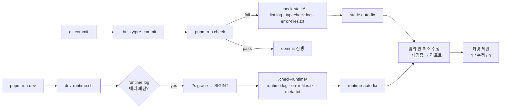

<div align="center">

# vibe-check-mate

**바이브 코딩의 가장 짜증나는 루프를 스킬 한 줄로 끝낸다.**

AI 보조 코딩에서 발생하는 lint·타입체크·런타임 에러를 정형 로그로 자동 캡처하고, **스킬 한 줄이면 범위 안에서만 최소 수정 → 재검증 → 커밋 제안까지 원샷**으로 처리하는 Claude Code 플러그인.

[Install](#install) · [Why](#why) · [How it works](#how-it-works) · [Workflow](#workflow) · [Changelog](#changelog)


</div>

---

## Why

> "수정은 최소한으로만 해주세요." — 매일 쓰는 프롬프트
> "다 고쳤다면서요? dev 서버 켜니까 `TypeError: Cannot read properties of null`..." — 매일 하는 복붙
> "아니 왜 그 파일까지 고쳐요. 되돌려주세요." — 매일 하는 되돌리기

AI 코딩은 **속도**를 주지만 **통제**를 잃습니다. 범위 밖 수정, 로그 복붙 루프, "다 됐습니다" 착시, AI의 반복 시도로 인한 토큰 낭비, 커밋 메시지 즉흥. `vibe-check-mate` 는 이 다섯 가지를 한 번에 묶어 자동화합니다. **개발 흐름은 그대로.**

---

## Features

| | |
|---|---|
| 🎨 **Biome 린터·포맷터 자동 세팅** | `package.json` · `tsconfig.json` · 디렉터리 구조를 분석해 React / Strict 여부 판정 → `base` / `react` / `strict` 중 **최적 preset 자동 적용** · `@biomejs/biome` 설치와 `biome.json` 구성까지 원샷 |
| 🪝 **Husky pre-commit 훅** | 커밋 시도 → `pnpm run check` 자동 실행, 실패 시 `.check-static/` 정형 로그 3파일 |
| 🤖 **dev server auto-kill** | Runtime 에러 패턴 감지 → 2s grace → 자동 SIGINT → `.check-runtime/` finalize |
| 🎯 **범위 강제** | `error-files.txt` ∩ 실제 수정 ∩ tracked, 3조건 교집합만 수정 · refactor / 네이밍 변경 / 신규 파일 금지 |
| 📝 **정형 리포트** | 모든 종료 지점에 케이스별 리포트 강제 출력 (path:line + 근거) · 침묵 exit 금지 |
| 💬 **커밋 제안** | Conventional Commits 자동 생성 → Y/수정/n 게이트 · Co-Authored-By 금지 · push 기본 금지 |
| 🗂 **분할 + push** | 기존 staged 작업 있어도 중단 없이 2커밋 분할 후 auto-push (단일 Y 게이트) |
| 🛑 **반복 수정 차단** | 최대 1회 시도 · 동일 에러 시그니처 반복 시 즉시 종료 (토큰 낭비 방지) |

---

## How it works



**`.check-*/` 는 "지금 실패" 스냅샷만 의미합니다.** 통과하거나 수정이 반영되면 자동 삭제. 스킬은 항상 최신 상태만 신뢰.

---

## Install

Claude Code 안에서:

```
/plugin marketplace add letYuchan/vibe-check-mate
/plugin install vibe-check-mate@vibe-check-mate-marketplace
```

로컬 개발 모드:

```
/plugin marketplace add /path/to/vibe-check-mate
/plugin install vibe-check-mate@vibe-check-mate-marketplace
```

프로젝트 루트에서 한 방 부트스트랩:

```
/vibe-check-mate:setup
```

실행 후 자동 구성:

| 구분 | 경로 |
|------|------|
| 정적 검사 래퍼 | `scripts/run-static-check-with-logs.sh` |
| dev 런타임 캡처 + auto-kill | `scripts/dev-runtime.sh` |
| Biome preset | `biome-config/biome.{base,react,strict}.json` |
| 루트 biome 설정 | `biome.json` (감지된 preset 으로 `extends`) |
| pre-commit 훅 | `.husky/pre-commit` |
| package.json scripts | `lint` · `lint:fix` · `typecheck` · `check` · `dev` · `dev:raw` |
| devDependencies | `@biomejs/biome` · `husky` |

> 권장 `.gitignore`: `.check-static/`, `.check-runtime/`

---

## Workflow

### 커밋이 lint / typecheck 로 차단될 때

```
static-auto-fix 돌려줘
```

→ 범위 안 최소 수정 → 재검증 → 정형 리포트 → 커밋 제안 `(Y / 수정 / n)`

### dev 서버에서 런타임 에러가 날 때

dev server 가 auto-kill 되고 `.check-runtime/` 가 자동으로 finalize 됩니다.

```
runtime-auto-fix 돌려줘
```

→ 범위 안 최소 수정 → `.check-runtime/` 자동 삭제 → 정형 리포트 → 커밋 제안

### 리포트 예시

```
✅ static check 통과

수정 대상: src/user.ts, src/post.ts
해결된 에러:
  - src/user.ts:12 — TS2322 : string → number 타입 맞춤
  - src/post.ts:5  — biome noVar : var → const
검증: pnpm run check ✓
정리: .check-static/ 삭제됨
커밋 제안: fix: resolve lint and type errors in src/ — (Y / 수정 / n)
```

### 스테이징 충돌 시 자동 분할 + push

이미 staged 된 작업이 있으면 block 하지 않고:

```
🗂 커밋 분할 + push 제안

[1/2 pre-staged] docs: update README
[2/2 fix]        fix: resolve type errors in src/user.ts

승인 시 위 순서로 커밋 후 git push 실행. (Y / 수정1 / 수정2 / n)
```

---

## Design principles

- **Deterministic 검증, constrained 수정** — 셸 스크립트는 결과를 재현 가능하게 기록, AI 는 기록된 범위 안에서만 수정
- `.check-*/` 는 누적 로그가 아닌 **"최신 실패 상태" 플래그** (통과·수정되면 자동 제거)
- `pre-commit` 은 **차단 + 로깅**만 담당, AI 수정은 별도 단계
- 런타임 문제와 정적 문제를 한 스킬에 **섞지 않음**
- 모든 종료 지점에서 **정형 리포트 강제 출력** (침묵 exit 금지)
- `git push` 기본 금지, 분할 경로에서만 명시 승인 후 예외 허용

---

## Stack

- **[Biome](https://biomejs.dev) 2.x** — 린터 + 포맷터 통합 도구. ESLint + Prettier 를 Rust 기반 단일 바이너리로 대체 · 이 플러그인은 프로젝트 유형을 감지해 `base` / `react` / `strict` 3종 preset 중 **최적을 자동 선택**하고 `biome.json extends` 를 자동 구성
- **[husky](https://typicode.github.io/husky) 9.x** — git hook 관리 · `pre-commit` 에 `pnpm run check` 주입
- **TypeScript 5.x** — `tsc --noEmit` 으로 타입 체크 (린트와 분리되어 이중 안전망)
- **tsx** — 가벼운 dev 실행 런타임 (Node 기반 프로젝트용, 프레임워크 dev server 도 래핑 가능)
- **pnpm** — 패키지 매니저 (기본, npm / yarn / bun 현재 미지원)
- **Node.js 18+**
- **Claude Code** — 플러그인 호스트

---

## Changelog

### v0.3.1
- `runtime-auto-fix` 수정 성공 시 `.check-runtime/` **자동 삭제** (static 쪽과 대칭)

### v0.3.0
- **dev server auto-kill** — `TypeError` · `ReferenceError` · `SyntaxError` · `Uncaught` · `Cannot find module` · `✘ [ERROR]` 감지 시 2초 grace 후 자동 SIGINT
- `VIBE_DEV_NO_AUTOKILL=1`, `VIBE_DEV_AUTOKILL_GRACE=<sec>` 환경 변수 지원
- 케이스 4 는 fallback 으로 유지 (클라이언트 전용 에러 · auto-kill 비활성화 대응)

### v0.2.0
- **스테이징 충돌 시 자동 분할 + push** 경로 (block 없음, 단일 Y 게이트)
- **모든 종료 지점 리포트 케이스 강제 매핑** (침묵 exit 금지)
- **bash chaining `;` 금지** (exit code 오판 방지)
- **반복 수정 루프 방지** — 최대 1회 시도, 동일 시그니처 반복 시 즉시 종료
- `biome.base.json` preset self-check 통과
- README pain-point 중심 재작성

### v0.1.1
- 셸 스크립트 `set -euo pipefail` 제거 — 각 체크가 실패해도 양쪽 로그 모두 기록
- Pre-flight 3중 검사 (git identity · rebase state · 스테이징)
- Auto-commit scope 엄격화 — `error-files.txt` ∩ 실제 수정 ∩ tracked
- HMR dev server Ctrl+C 안내 + SIGINT trap

### v0.1.0
- 초기 릴리스

---

## License

[MIT](./LICENSE) — Ship without breaking the flow.
